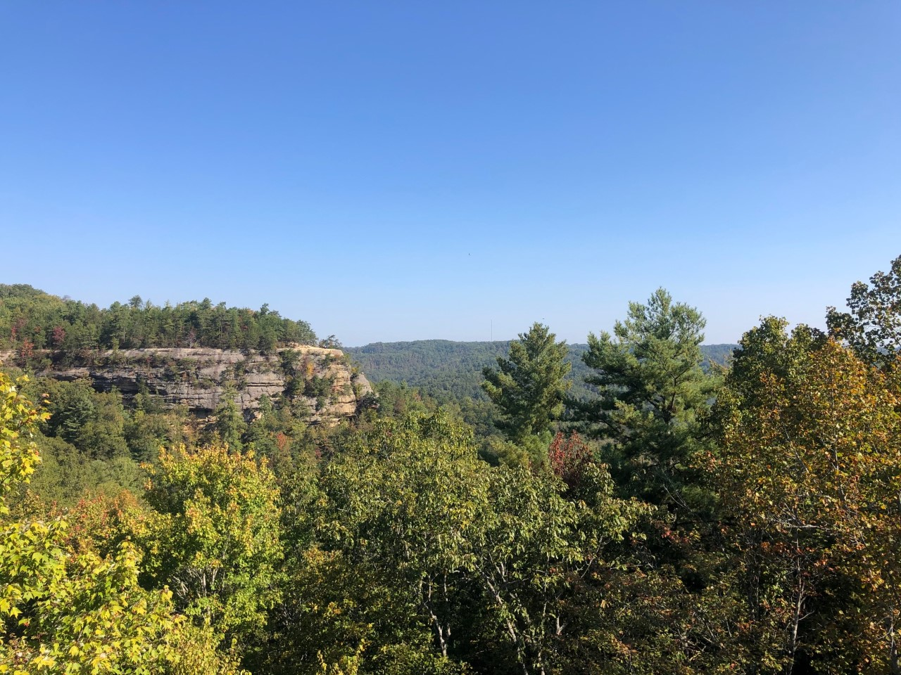
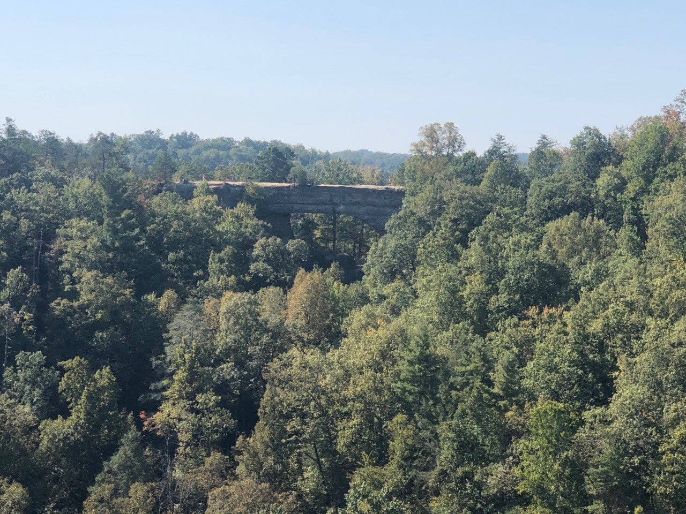

<html>

<head>
  <meta charset='utf-8' />
  <title>Display a map</title>
  <meta name='viewport' content='initial-scale=1,maximum-scale=1,user-scalable=no' />

  
  <link href='https://api.mapbox.com/mapbox-gl-js/v2.2.0/mapbox-gl.css' rel='stylesheet' />

  
</head>

<body>

  

  

</body>

</html>

# Natural Bridge Valley

### Natural Bridge was established as a State Park in 1926. It was a major tourist destination before that though. The arch stretches 78 feet and is 65 feet high, the top where you can walk across spans 30 feet wide.

# Cesium Ion Presentation of Natural Bridge Valley
<html>

<head>
  <meta charset='utf-8' />
  <title>Display a tour</title>
  <meta name='viewport' content='initial-scale=1,maximum-scale=1,user-scalable=no' />

  
</head>

<body>
  <section>

    <!-- 💡💡💡 paste embed code below -->

    <iframe title="Paint by Nature: Go See Trees" width="100%" height="800px" src="https://cesium.com/ion/stories/viewer/?id=395cc63a-ee79-4e9d-9266-10dd7ef2acf4" frameborder="0" allow="fullscreen" allowfullscreen="true" mozallowfullscreen="true" webkitallowfullscreen="true"></iframe>
  
    </section>
</body>

</html>

Photo Taken by: Hogan Federmann
## This is a photo I took last year from on top of Natural Bridge.

Photo Taken by: Hogan Federmann
## Just a 10-15 minute hike from Natural Bridge you will find Battleship Rock, which offers an amazing view of Natural Bridge and a 270 degree view of the surrounding valley.

Sources:
https://www.cliffviewresort.com/things-to-do/natural-bridge-state-park/